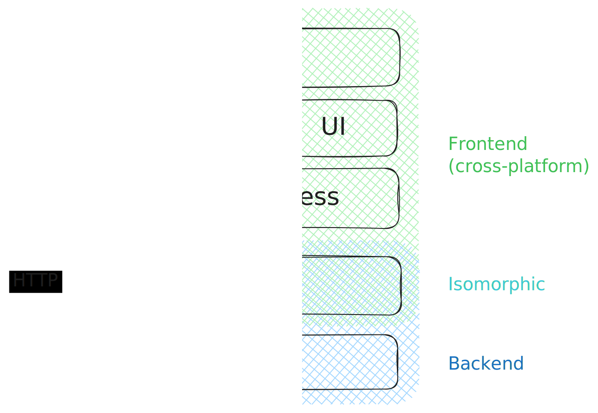
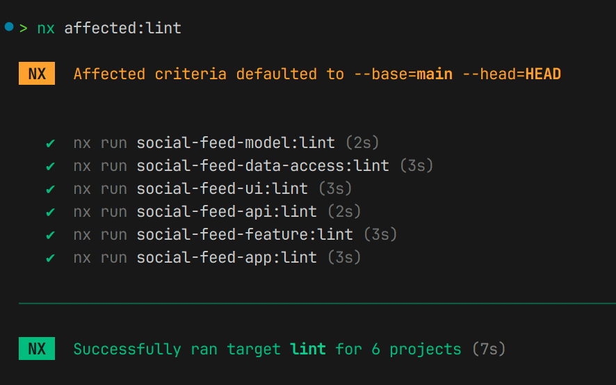
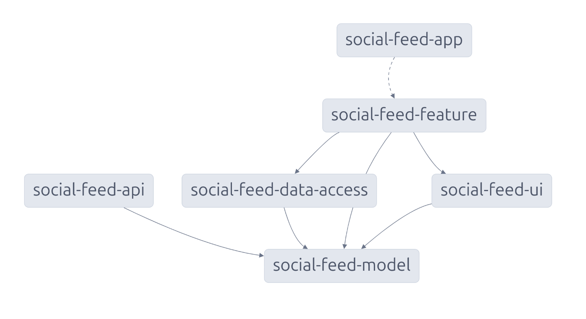

This article is part of a practical series on building cross-platform apps using **Angular**, **Ionic**, **Capacitor**, and **Nx**.

- [Part 1 · Workspace setup and app initialization](/a-practical-guide-to-building-cross-platform-apps-with-angular-ionic-capacitor-and-nx-part-1/)
- Part 2 · Building a social feed (📍 you are here)

---

In this second part, we'll see how to create a social feed integrated into a cross-platform app, **featuring a virtual infinite scroll** for seamless content loading. We'll set up a **modular architecture** with services for data access, shared models, and reusable UI components to keep the app clean and maintainable.

Here's a demo on my Android phone:

<video loop autoplay controls width="58%">
  <source src="ui.mp4" type="video/mp4">
</video>

## Architecture overview

Before we start coding, let's break down the architecture for our social feed. Our app is organized into three main layers:

1. **Frontend**: This includes the main app, feature modules, UI components, and a dedicated data access layer.
2. **Isomorphic layer**: Shared models used across the frontend and backend.
3. **Backend**: An Express-based API providing the data for our feed.

Below is a high-level diagram showing the relationships between the components:



This architecture ensures a **clean separation of concerns**. The backend API handles data serving, the isomorphic layer ensures consistent models, and the frontend provides a modular structure for user-facing features.

## Scaffolding the workspace

To implement our architecture, we generate the necessary apps and libraries:

```bash
# Generate the frontend app
nx g @nx/angular:app apps/social-app --tags=type:app,platform:mobile,platform:web
nx g @nxext/ionic-angular:configuration social-app

# Generate the backend API
nx g @nx/express:app --directory=apps/social-feed-api --frontendProject=social-feed-app --tags=type:app,platform:node

# Generate the libraries
nx g @nx/angular:library libs/social-feed-feature --tags=type:feature,platform:mobile,platform:web
nx g @nx/angular:library libs/social-feed-data-access --tags=type:data-access,platform:mobile,platform:web
nx g @nx/angular:library libs/social-feed-model --tags=type:model,platform:node,platform:mobile,platform:web
nx g @nx/angular:library libs/social-feed-ui --tags=type:ui,platform:mobile,platform:web
```

Most of the code will reside in the libraries, as our goal is to keep the applications lightweight and focused solely on configuration and orchestration.

> **Note: 📌** <br> If you need a deeper understanding of workspace setup and tooling configuration, refer to [Part 1 of this series](/a-practical-guide-to-building-cross-platform-apps-with-angular-ionic-capacitor-and-nx-part-1/) where we covered these topics in detail.

Let's forget about the `--tags` for now—I'll explain their purpose and how they help with project organization and dependency management later.

### The folder structure

This folder structure organizes the project into apps and libraries.

```bash
apps/
├── social-app/              # Cross-platform Angular app
├── social-feed-api/         # Express backend API
libs/
├── social-feed-feature/     # Library for social feed business logic
├── social-feed-data-access/ # Library for data fetching
├── social-feed-model/       # Library for shared TypeScript models
├── social-feed-ui/          # Library for reusable UI components
```

We've kept it relatively flat because **the project focuses on a single domain** (social feed). If the project expanded to include multiple domains, a more nested structure could be beneficial to group related types and features within the same domain.

## Starting the implementation

Now that the workspace is set up, it's time to start coding! We'll approach this in a modular way, focusing on one part of the architecture at a time.

### Create the model

In the `social-feed-model` library, we'll start by defining the data model that will be shared between the frontend and backend. This ensures we have a consistent structure for the data.

```ts
// libs/social-feed-model/src/lib/social-post.model.ts

export interface SocialPostModel {
  id: string;
  title: string;
  subtitle: string;
  content: string;
  image: string;
  likes: number;
}
```

### Build the data access layer

In the `social-feed-data-access` library, we'll implement the service to fetch the data from the backend API. This service will handle HTTP requests.

```ts
// libs/social-feed-data-access/src/lib/social-feed-data-access.service.ts

@Injectable({ providedIn: 'root' })
export class SocialFeedDataAccess {
  private readonly http = inject(HttpClient);

  getFeed() {
    return this.http.get<SocialPostModel[]>('/api/feed');
  }
}
```

> **Note: 📌** <br> The API is proxied under the same domain so we don't have to manage CORS issues, thanks to the `--frontendProject` option that we used when generating the API.

```json
{
  "/api": {
    "target": "http://localhost:3333",
    "secure": false
  }
}
```

### Creating the UI library

In the `social-feed-ui` library, let's create the presentational component that displays individual posts in the feed. This component will receive a `SocialPostModel` object and render its content.

```ts
// libs/social-feed-ui/src/lib/social-post.component.ts

@Component({
  selector: 'social-post-ui',
  standalone: true,
  imports: [
    IonCard,
    IonCardContent,
    IonCardHeader,
    IonCardSubtitle,
    IonCardTitle,
    IonIcon,
  ],
  template: `
    @let p = post();
    <ion-card>
      
      <ion-card-header>
        <ion-card-title>{{ p.title }}</ion-card-title>
        <ion-card-subtitle>{{ p.subtitle }}</ion-card-subtitle>
      </ion-card-header>
      <ion-card-content>
        {{ p.content }}
        <div class="ion-margin-top">
          <ion-icon name="heart"></ion-icon> {{ p.likes }}
        </div>
      </ion-card-content>
    </ion-card>
  `,
})
export class SocialPostComponent {
  readonly post = input.required<SocialPostModel>();

  constructor() {
    addIcons({ heart });
  }
}
```

Here's how it looks:


For other UI elements like [cards](https://ionicframework.com/docs/api/card), [infinite scrolling](https://ionicframework.com/docs/api/infinite-scroll), and [virtual scrolling](https://material.angular.io/cdk/scrolling/overview), we'll rely on Ionic and the Angular CDK, as they provide powerful, pre-built components to handle these features efficiently.

### Building the feature library

The feature library implements the **core business logic** for our social feed. This is where we bring everything together: fetching the data, passing it to the UI, and implementing the virtual and infinite scroll to handle large sets of posts efficiently.

In the `social-feed-feature` library, we create a smart component to manage the feed. This component is responsible for:

- Fetching posts using the `SocialFeedDataAccess` service, which communicates with the backend.
- Managing virtual scrolling with `cdk-virtual-scroll-viewport` to only render visible posts, improving performance.
- Implementing infinite scroll using Ionic's `IonInfiniteScroll` to load more posts as the user scrolls.
- Delegating the presentation of individual posts to the `social-post-ui` component.

```ts
// libs/social-feed-feature/src/lib/social-feed-feature.component.ts

const trackById = <T extends { id: string }>(idx: number, item: T) => item.id;

@Component({
  selector: 'social-feed-feature',
  standalone: true,
  imports: [
    IonContent,
    IonInfiniteScroll,
    IonInfiniteScrollContent,
    ScrollingModule,
    SocialPostComponent,
  ],
  template: `
    <ion-content class="ion-padding" scroll-y="false">
      <cdk-virtual-scroll-viewport
        itemSize="450"
        minBufferPx="1500"
        maxBufferPx="3000"
        class="ion-content-scroll-host"
      >
        <social-post-ui
          *cdkVirtualFor="let post of posts(); trackBy: trackById"
          [post]="post"
        />
        <ion-infinite-scroll (ionInfinite)="loadPosts($event)">
          <ion-infinite-scroll-content
            loadingSpinner="bubbles"
            loadingText="Loading more data..."
          />
        </ion-infinite-scroll>
      </cdk-virtual-scroll-viewport>
    </ion-content>
  `,
  styles: `
    cdk-virtual-scroll-viewport {
      height: 100%;
      width: 100%;
    }
  `,
})
export default class SocialFeedFeatureComponent implements OnInit {
  private readonly socialFeedDataAccess = inject(SocialFeedDataAccess);
  readonly posts = signal<SocialPostModel[]>([]);
  readonly trackById = trackById;

  ngOnInit() {
    this.loadPosts();
  }

  loadPosts(event?: InfiniteScrollCustomEvent): void {
    this.socialFeedDataAccess.getFeed().subscribe((newPosts) => {
      this.posts.update((posts) => [...posts, ...newPosts]);
      event?.target.complete();
    });
  }
}
```

This setup keeps the logic for fetching data, handling the scroll, and rendering the UI separated, making the application well decoupled and easily maintainable.

#### Reactive refactoring

While the original approach works, it relies on imperative constructs such as the `subscribe()` function call and the `ngOnInit()` lifecycle hook. To address this, we can leverage Angular 19's **reactive features**, such as `rxResource`, to create a cleaner, declarative solution.

Here's the improved implementation:

```ts
// libs/social-feed-feature/src/lib/social-feed-feature.component.ts

@Component({
  // ...
})
export default class SocialFeedFeatureComponent {
  private readonly socialFeedDataAccess = inject(SocialFeedDataAccess);
  private readonly IonInfiniteScroll = viewChild.required(IonInfiniteScroll);
  private readonly index = signal(0);

  // highlight-start
  private readonly postsResource = rxResource({
    request: this.index,
    loader: () => this.socialFeedDataAccess.getFeed(),
  });
  private readonly accumulatePosts = effect(() => {
    const newPosts = this.postsResource.value() ?? [];
    this.posts.update((posts) => [...posts, ...newPosts]);
    this.IonInfiniteScroll().complete();
  });
  // highlight-end

  readonly posts = signal<SocialPostModel[]>([]);
  readonly trackById = trackById;

  loadPosts(): void {
    this.index.update((index) => index + 1);
  }
}
```

#### Highlighted improvements

1. **`rxResource`**:

   - Abstracts the backend fetch logic, eliminating manual subscriptions.
   - Integrates seamlessly with Angular's reactivity system.

2. **Signals for state management**:

   - `signal` and `effect` replace imperative constructs like `ngOnInit` and `subscribe`, making the logic declarative.
   - `index` controls pagination reactively, triggering new fetches when updated.

3. **Eliminating lifecycle hooks**:
   - The setup relies purely on reactive constructs, removing the need for lifecycle hooks like `ngOnInit`, making the component more concise and functional.

> **Note: 📌** <br> While these features are exciting, keep in mind that, at the moment, `rxResource` is experimental, and `effect` is in developer preview. To learn more about the state of these features, check out the excellent [angular.courses/caniuse](https://www.angular.courses/caniuse?fflags=version-summary) interactive table.

#### Configuring feature routes

Now, we need to define the routes for the feature so it can be accessed in the app. The routing is straightforward; we define the path `/feed` to load our social feed component and redirects the default path to it.

```ts
// libs/social-feed-feature/src/lib/social-feed-feature.routes.ts

export const routes: Routes = [
  {
    path: 'feed',
    loadComponent: () => import('./social-feed-feature.component'),
  },
  {
    path: '',
    redirectTo: '/feed',
    pathMatch: 'full',
  },
];
```

> **Note: 📌** <br> Angular automatically unwraps the `default` exported component in the routing, so we don't have to use `.then((m) => m.myComponent)`.

### Setting up the app

At this point, we can configure the main app to use the feature we just built. The app's tab layout includes a button to navigate to the feed. We'll use Ionic's tab navigation to set up the feed as one of the tabs.

```ts
// apps/social-feed-app/src/app/tabs/tabs.page.ts

@Component({
  selector: 'app-tabs',
  template: `
    <ion-tabs>
      <ion-tab-bar slot="bottom">
        <ion-tab-button tab="feed" href="/feed">
          <ion-icon name="earth-outline"></ion-icon>
        </ion-tab-button>
      </ion-tab-bar>
    </ion-tabs>
  `,
  standalone: true,
  imports: [IonTabs, IonTabBar, IonTabButton, IonIcon],
})
export class TabsComponent {
  constructor() {
    addIcons({ earthOutline });
  }
}
```

Here, we define a tab bar with an icon that links to the `/feed` route. When the user taps on this tab, they'll be taken to the social feed feature we created.

```ts
// apps/social-feed-app/src/app/tabs/tabs.routes.ts

export const routes: Routes = [
  {
    path: '',
    component: TabsComponent,
    children: [
      {
        path: '',
        loadChildren: () =>
          import('@social-feed/social-feed-feature').then((m) => m.routes),
      },
    ],
  },
];
```

> **Note: 📌** <br> The app acts as an orchestrator (shell), delegating the logic to the corresponding feature library using the router.

Lastly, we configure the root routes for the app, so the app starts with the tabs component.

```ts
// apps/social-feed-app/src/app/app.component.ts

@Component({
  selector: 'app-root',
  template: `<ion-app>
    <ion-router-outlet />
  </ion-app>`,
  standalone: true,
  imports: [IonApp, IonRouterOutlet],
})
export class AppComponent {}
```

```ts
// apps/social-feed-app/src/app/app.routes.ts

export const routes: Routes = [
  {
    path: '',
    loadChildren: () => import('./tabs/tabs.routes').then((m) => m.routes),
  },
];
```

This layout component technique, using the router to manage different views, is something I've already described in more detail in my article on [reusable layouts in Angular](/reusable-layouts-in-angular/).

### Configuring the main module

In the main entry point of our application, we configure the necessary providers to bootstrap the app and enable essential features such as routing, HTTP communication, and Ionic support.

```ts
// apps/social-feed-app/src/main.ts

bootstrapApplication(AppComponent, {
  providers: [
    { provide: RouteReuseStrategy, useClass: IonicRouteStrategy },
    provideIonicAngular(),
    provideRouter(routes, withPreloading(PreloadAllModules)),
    provideHttpClient(),
  ],
});
```

### Setting up the API

For the backend, we'll use Express to serve our social feed data. To simulate a real-world API, we'll use the `@faker-js/faker` library to generate fake data for the feed. This allows us to focus on the frontend without needing a full backend setup during development.

```ts
// apps/social-feed-api/src/main.ts

const app = express();

app.get('/api/feed', (req, res) => {
  res.json(
    Array.from(
      { length: 50 },
      () =>
        ({
          id: faker.string.uuid(),
          title: faker.lorem.sentence(3),
          subtitle: faker.lorem.sentence(5),
          content: faker.lorem.paragraph(),
          image: faker.image.urlLoremFlickr({ width: 400, height: 300 }),
          likes: faker.number.int({ min: 0, max: 100 }),
        }) satisfies SocialPostModel
    )
  );
});

const port = process.env.PORT || 3333;
const server = app.listen(port, () => {
  console.log(`Listening at http://localhost:${port}/api`);
});
server.on('error', console.error);
```

The response is typed with the `SocialPostModel`, ensuring that the data structure is consistent across the app. This model is shared between the backend and the frontend to ensure **type safety**.

### Running the app

At this point, you can now run the app on different platforms (iOS, Android, and web). To run both the backend and frontend concurrently:

```bash
nx run-many -t serve
```

<video loop autoplay controls width="100%">
  <source src="ui2.mp4" type="video/mp4">
</video>

### Enforcing module boundaries

To ensure a clean architecture over time, we enforce module boundaries using the `@nx/enforce-module-boundaries` rule in our ESLint configuration. This rule restricts dependencies between projects based on their tags, preventing unintended coupling and enforcing platform-specific constraints.

<details>

<summary>See the full configuration</summary>

```js
// eslint.config.js

module.exports = [
  ...nx.configs['flat/base'],
  ...nx.configs['flat/typescript'],
  ...nx.configs['flat/javascript'],
  {
    ignores: ['**/dist', '**/android', '**/ios'],
  },
  {
    files: ['**/*.ts', '**/*.tsx', '**/*.js', '**/*.jsx'],
    rules: {
      '@nx/enforce-module-boundaries': [
        'error',
        {
          enforceBuildableLibDependency: true,
          allow: ['^.*/eslint(\\.base)?\\.config\\.[cm]?js$'],
          depConstraints: [
            {
              sourceTag: 'type:app',
              onlyDependOnLibsWithTags: [
                'type:feature',
                'type:ui',
                'type:model',
              ],
            },
            {
              sourceTag: 'type:feature',
              onlyDependOnLibsWithTags: [
                'type:data-access',
                'type:ui',
                'type:model',
              ],
            },
            {
              sourceTag: 'type:data-access',
              onlyDependOnLibsWithTags: ['type:model'],
            },
            {
              sourceTag: 'type:ui',
              onlyDependOnLibsWithTags: ['type:model'],
            },
            {
              sourceTag: 'type:model',
              onlyDependOnLibsWithTags: [],
            },
            {
              sourceTag: 'platform:node',
              onlyDependOnLibsWithTags: ['platform:node'],
            },
            {
              sourceTag: 'platform:mobile',
              onlyDependOnLibsWithTags: ['platform:mobile'],
            },
            {
              sourceTag: 'platform:web',
              onlyDependOnLibsWithTags: ['platform:web'],
            },
          ],
        },
      ],
    },
  },
  {
    files: ['**/*.ts', '**/*.tsx', '**/*.js', '**/*.jsx'],
    // Override or add rules here
    rules: {},
  },
];
```

</details>

The configuration includes the following key rules:

- **Apps (`type:app`)** can only depend on feature libraries, UI libraries, and model libraries.
- **Feature libraries (`type:feature`)** can depend on data-access libraries, UI libraries, and model libraries.
- **Data-access libraries (`type:data-access`)** are restricted to model libraries.
- **UI libraries (`type:ui`)** can only depend on model libraries.
- **Model libraries (`type:model`)** are pure and cannot depend on other libraries.
- **Platform-specific constraints** ensure that, for example, Node.js libraries (`platform:node`) cannot depend on mobile or web libraries.



> **Note: 📌** <br> These rules are subjective and may not represent the optimal choice for every situation. Adjust them based on your project's specific needs and constraints.

### Wrapping up

In this project, we've successfully a cross-platform social feed application. Starting with a clear separation of concerns, we divided the project into reusable libraries and apps that simplify development and future scaling.

The frontend app, built with Angular, Ionic, and Capacitor, delivers a seamless user experience across web, iOS, and Android platforms. On the backend, the server app provides mock data through a lightweight Express API, making it easy to simulate real-world scenarios during development. Each library encapsulates a specific responsibility—UI components, data access, business logic, or shared models—ensuring a maintainable and scalable codebase.



**This project demonstrates the power of combining modern tools like Angular, Ionic, and Nx to build apps competitive apps efficiently.** With this solid foundation in place, you're ready to expand your app's capabilities, confident that the current architecture is flexible and can be adapted to meet your future needs.

The complete source code for this project is available in the [GitHub repository](https://github.com/edbzn/social-feed).

### References:

- **[Nx Cookbook](https://cookbook.marmicode.io/nx/intro/)** by Marmicode
- **[Nx Documentation](https://nx.dev)**
- **[Nxext Documentation](https://nxext.dev/)**
- **[Ionic Framework](https://ionicframework.com)**
- **[Capacitor Documentation](https://capacitorjs.com)**
