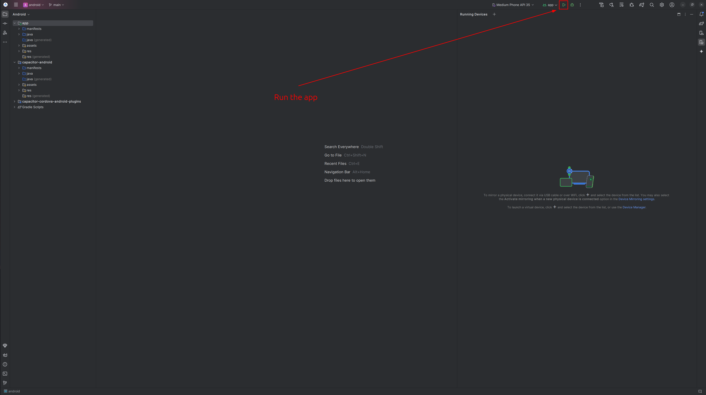
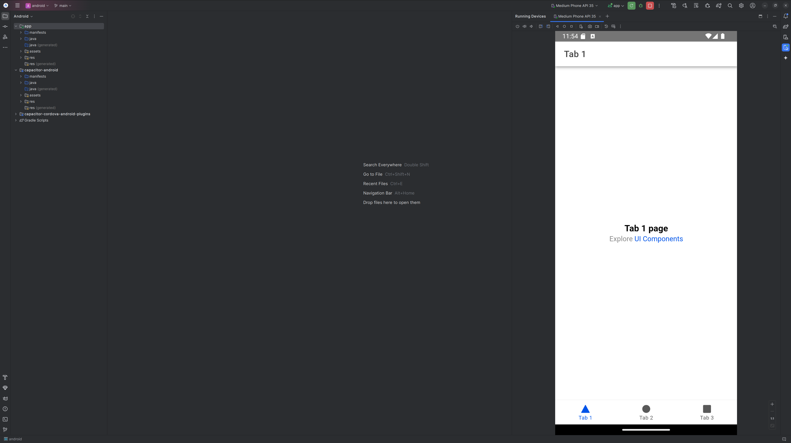

This article is part of a practical series on building cross-platform apps using **Angular**, **Ionic**, **Capacitor**, and **Nx**. In this first part, I'll guide you through setting up your workspace and running your app on the web and Android platforms.

## Step 1: Initialize the Workspace and Application

To begin, you'll create an Nx workspace, add Ionic and Capacitor configurations, and prepare your app for development.

### 1.1 Initialize the Nx Workspace

Run the following command to set up your Nx workspace with the `angular-monorepo` preset:

```bash
npx create-nx-workspace@latest my-workspace --preset=angular-monorepo
```

> **Note: 📌** <br>
> The `angular-monorepo` preset sets up a scalable workspace with Angular. <br>
> Choose **ESBuild** (recommended for faster builds) or **Webpack** during setup, and opt out of SSR, as Ionic apps use client-side rendering.

Enter in `my-workspace` directory:

```bash
cd my-workspace
```

### 1.2 Add `@nxext/angular-ionic`

Next, install the `@nxext/angular-ionic` package, which provides generators for configuring and running Ionic apps:

```bash
npm install @nxext/ionic-angular -D
```

### 1.3 Configure Capacitor for Your App

Run the following command to add Capacitor configuration files for your app:

```bash
nx g @nxext/ionic-angular:configuration my-app
```

At this point, your workspace is ready to build and run your app.

## Step 2: Running `my-app` on the Web Platform

Running your app in a web browser is straightforward.

### 2.1 Serve the App in the Browser

Run the following command to serve your app:

```bash
nx serve my-app
```

Once the server starts, open the URL displayed in the terminal to view your app.


🌈 **Ta-da!** Your app is now running in the browser.

## Step 3: Running `my-app` on the Android Platform

To test your app on an Android device or emulator, follow these steps:

### 3.1 Install Android Studio

Download and install [Android Studio](https://developer.android.com/studio) to emulate or deploy your app on Android devices.


> **Note:** 📌<br>
> Check the installation guide for more information: https://developer.android.com/studio/install

### 3.2 Add the Android Platform

Add the Android platform to your app by running:

```bash
nx run my-app:add:android
```

This command generates platform-specific files needed to run your app on Android.

### 3.3 Open the App in Android Studio

Use Nx to open your app directly in Android Studio:

```bash
nx run my-app:open:android
```

Android Studio will open, displaying a project view similar to this:



### 3.4 Run the App on the Emulator

1. In Android Studio, click the **Run** button (the green triangle).
2. Wait for the app to build and launch on the Android emulator.



🌟 **Congratulations!** Your app is now running on an Android emulator.

### 3.5 Run the App on your Connected Device (optional)

1. Activate the developer mode on your device ([guide](https://developer.android.com/studio/debug/dev-options)).
2. Setup your device for development ([guide](https://developer.android.com/studio/run/device)).

### 4.0 Apply Your Changes

To reflect your modifications in Android Studio, rebuild your app:

```bash
nx build my-app
```

Sync your app's changes to the Android platform:

```bash
nx run my-app:sync:android
```

Now, rerun the app in Android Studio to see your changes applied.

> **Note:** 📌<br>
> To automatically rebuild the app when running the `sync` target, configure `targetDefaults` in `nx.json`.

```json
{
  "targetDefaults": {
    "sync": {
      "dependsOn": ["build"]
    }
  }
}
```

## Conclusion

In this article, you’ve set up an Nx workspace, configured Angular, Ionic, and Capacitor, and successfully ran your app on the web and Android platforms. With these foundations in place, you’re ready to expand your app’s capabilities and target additional platforms.

Stay tuned for the next part of this series, where we’ll dive deeper into building and deploying cross-platform features.

### References:

- [Nx Documentation](https://nx.dev)
- [Nxext Documentation](https://nxext.dev/)
- [Ionic Framework](https://ionicframework.com)
- [Capacitor Documentation](https://capacitorjs.com)
