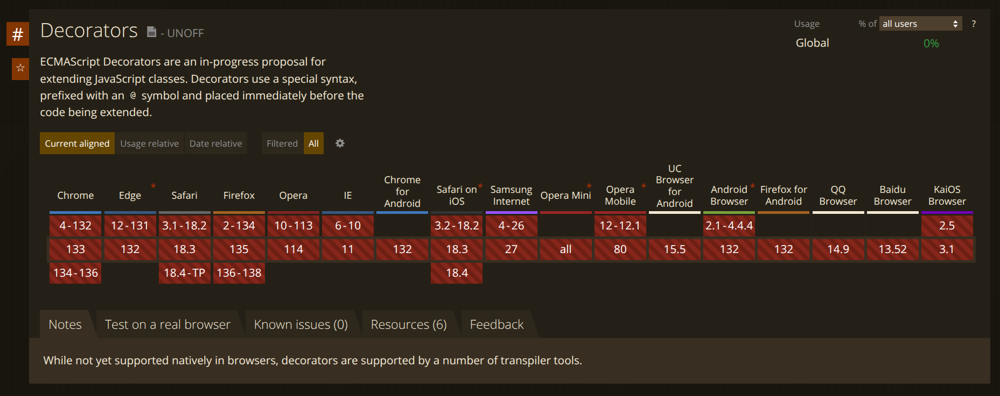

## Introduction

Recently I have been experimenting with running TypeScript code in directly the browser, my tweet got a some attention, so I decided to write a blog post about it.

`oembed: https://twitter.com/edbzn/status/1887993578158166501`

### A bit of context

Node.js v22.6.0 introduced an interesting [**type stripping feature**](https://nodejs.org/docs/v22.13.1/api/typescript.html#type-stripping), which allows you to **run TypeScript files without compiling them first**. Additionally, the TypeScript team has been working to improve support for this feature with the **[erasable syntax flag](https://www.totaltypescript.com/erasable-syntax-only)**, introduced in v5.8 beta.

These efforts push the **nobuild workflow** to the next level. But what about the front-end space? Can we run Angular applications without a build step?

## Loading ES modules in the browser

In order to use Angular, we need to load modules in the browser at runtime, like so:

```ts
import { bootstrapApplication } from '@angular/platform-browser';
```

To be able to import ES Modules, we have to specify the `type="module"` attribute in the script tag.

```html
<script type="module">
  /* Here we can import ES Modules */
</script>
```

### Loading dependencies from a CDN using import maps

For a modern approach, we can leverage import maps to map the module names to actual files served remotely via an URL.

```html
<script type="importmap">
  {
    "imports": {
      "@angular/core": "https://ga.jspm.io/npm:@angular/core@19.1.0/fesm2022/core.mjs",
      "@angular/core/primitives/signals": "https://ga.jspm.io/npm:@angular/core@19.1.0/fesm2022/primitives/signals.mjs",
      "@angular/core/primitives/event-dispatch": "https://ga.jspm.io/npm:@angular/core@19.1.0/fesm2022/primitives/event-dispatch.mjs",
      "@angular/compiler": "https://ga.jspm.io/npm:@angular/compiler@19.1.0/fesm2022/compiler.mjs",
      "@angular/platform-browser": "https://ga.jspm.io/npm:@angular/platform-browser@19.1.0/fesm2022/platform-browser.mjs",
      "@angular/common": "https://ga.jspm.io/npm:@angular/common@19.1.0/fesm2022/common.mjs",
      "@angular/common/http": "https://ga.jspm.io/npm:@angular/common@19.1.0/fesm2022/http.mjs",
      "rxjs": "https://cdn.jsdelivr.net/npm/rxjs@7.8.1/+esm",
      "rxjs/operators": "https://cdn.jsdelivr.net/npm/rxjs@7.8.1/operators/+esm"
    }
  }
</script>
```

This way we get rid of the need to install and bundle the Angular dependencies, and we can load them directly from a CDN.

### Loading ES modules from TypeScript files

Now that we have the Angular modules loaded, we want to be able to _load our TypeScript source files as ES Modules_. We can do this by using the **[es-module-shims](https://github.com/guybedford/es-module-shims) polyfill library**.

It is quite simple to use, we just need to include the library in our HTML file, and enable the TypeScript support.

```html
<script async src="https://ga.jspm.io/npm:es-module-shims@2.0.9/dist/es-module-shims.js"></script>
<script type="esms-options">
  { "polyfillEnable": ["typescript"] }
</script>
```

Under the hood, ES Module Shims will **strip the types using WebAssembly**, and load the resulting JavaScript code in the browser.

<Note>Runtime TypeScript features such as enums are not supported, and type only imports should be used where possible, per the Node.js guidance for TypeScript.</Note>

## Bootstrapping the Angular application

Finally, we can bootstrap our Angular application by calling the `bootstrapApplication` function and passing the `AppComponent`.

```html
<body>
  <script type="module" lang="ts">
    import "@angular/compiler";
    import { bootstrapApplication } from "@angular/platform-browser";
    import { provideExperimentalZonelessChangeDetection } from "@angular/core";
    import { AppComponent } from "./app.component.ts";

    bootstrapApplication(AppComponent, {
      providers: [provideExperimentalZonelessChangeDetection()],
    }).catch((err) => console.error(err));
  </script>
  <app-root></app-root>
</body>
```

To run Angular without build step we have to import the `@angular/compiler` module to **enable JIT compilation**. Of course, this has a **performance impact**, but it can be useful for development purposes, or highly dynamic applications.

<Note>Just like dealing with ESM in Node.js, **file extension is mandatory** when importing a module, so we need to specify the `.ts` or `.mts` in the import statement.</Note>

### Decorators and metadata

By default Angular uses experimental decorators and metadata to define components, services, and other entities.

```ts
@Component({
  selector: 'app-root',
  template: '<h1>{{ title() }}</h1>',
  styles: `h1 { text-align: center; }`,
})
export class AppComponent {
  readonly title = signal('Hello, Angular!');
}
```

However these are not supported in the browser, resulting in a runtime error:

```text
Uncaught SyntaxError: Invalid or unexpected token (at app.component.ts:22:5)
```

To work around this, we can polyfill decorators using the following `_ts_decorate` function.

```ts
function _ts_decorate(decorators, target, key, desc) {
  var c = arguments.length,
    r =
      c < 3
        ? target
        : desc === null
        ? (desc = Object.getOwnPropertyDescriptor(target, key))
        : desc,
    d: (arg0: any, arg1: undefined, arg2: undefined) => any;
  if (typeof Reflect === 'object' && typeof Reflect.decorate === 'function')
    r = Reflect.decorate(decorators, target, key, desc);
  else
    for (var i = decorators.length - 1; i >= 0; i--)
      if ((d = decorators[i]))
        r = (c < 3 ? d(r) : c > 3 ? d(target, key, r) : d(target, key)) || r;
  return c > 3 && r && Object.defineProperty(target, key, r), r;
}

export const AppComponent = _ts_decorate(
  [
    Component({
      selector: 'app-root',
      template: '<h1>{{ title() }}</h1>',
      styles: `h1 { text-align: center; }`,
    }),
  ],
  class {
    readonly title = signal('Hello, Angular!');
  }
);

```

This helper function is produced by TypeScript when compiling decorators, and it can be used to **apply decorators at runtime**.

That's it! 🚀 We have now an Angular application up and running, with no build step, no Node.js, and no npm.

## Demo

<iframe loading="lazy" width="100%" height="600px" src="https://stackblitz.com/edit/stackblitz-starters-rsqjggqj?ctl=1&embed=1&file=index.html"></iframe>

### What about standard ES decorators?

Angular _almost fully supports_  standard ES decorators, but only if you stick to the `inject` function for dependency injection. See [this PR](https://github.com/angular/angular/pull/49492) for more details.

However the [Decorators](https://github.com/tc39/proposal-decorators) and [Decorators Metadata](https://github.com/tc39/proposal-decorator-metadata) proposals and are still in **stage 3**, and it's not clear when it will be finalized and implemented in browsers.



I looked at the generated code to polyfill ES decorators, but it's quite complex compared to experimental decorators. For instance the following code:

```ts
@Component
class test {}
```

Is transpiled to:

```ts
"use strict";
var __esDecorate = (this && this.__esDecorate) || function (ctor, descriptorIn, decorators, contextIn, initializers, extraInitializers) {
    function accept(f) { if (f !== void 0 && typeof f !== "function") throw new TypeError("Function expected"); return f; }
    var kind = contextIn.kind, key = kind === "getter" ? "get" : kind === "setter" ? "set" : "value";
    var target = !descriptorIn && ctor ? contextIn["static"] ? ctor : ctor.prototype : null;
    var descriptor = descriptorIn || (target ? Object.getOwnPropertyDescriptor(target, contextIn.name) : {});
    var _, done = false;
    for (var i = decorators.length - 1; i >= 0; i--) {
        var context = {};
        for (var p in contextIn) context[p] = p === "access" ? {} : contextIn[p];
        for (var p in contextIn.access) context.access[p] = contextIn.access[p];
        context.addInitializer = function (f) { if (done) throw new TypeError("Cannot add initializers after decoration has completed"); extraInitializers.push(accept(f || null)); };
        var result = (0, decorators[i])(kind === "accessor" ? { get: descriptor.get, set: descriptor.set } : descriptor[key], context);
        if (kind === "accessor") {
            if (result === void 0) continue;
            if (result === null || typeof result !== "object") throw new TypeError("Object expected");
            if (_ = accept(result.get)) descriptor.get = _;
            if (_ = accept(result.set)) descriptor.set = _;
            if (_ = accept(result.init)) initializers.unshift(_);
        }
        else if (_ = accept(result)) {
            if (kind === "field") initializers.unshift(_);
            else descriptor[key] = _;
        }
    }
    if (target) Object.defineProperty(target, contextIn.name, descriptor);
    done = true;
};
var __runInitializers = (this && this.__runInitializers) || function (thisArg, initializers, value) {
    var useValue = arguments.length > 2;
    for (var i = 0; i < initializers.length; i++) {
        value = useValue ? initializers[i].call(thisArg, value) : initializers[i].call(thisArg);
    }
    return useValue ? value : void 0;
};
let test = (() => {
    let _classDecorators = [Component];
    let _classDescriptor;
    let _classExtraInitializers = [];
    let _classThis;
    var test = class {
        static { _classThis = this; }
        static {
            const _metadata = typeof Symbol === "function" && Symbol.metadata ? Object.create(null) : void 0;
            __esDecorate(null, _classDescriptor = { value: _classThis }, _classDecorators, { kind: "class", name: _classThis.name, metadata: _metadata }, null, _classExtraInitializers);
            test = _classThis = _classDescriptor.value;
            if (_metadata) Object.defineProperty(_classThis, Symbol.metadata, { enumerable: true, configurable: true, writable: true, value: _metadata });
            __runInitializers(_classThis, _classExtraInitializers);
        }
    };
    return test = _classThis;
})();
```
Which is harder to implement than the experimental decorators polyfill. I hope that the decorators proposal will be finalized soon, so we can use standard ES decorators directly the browser.
