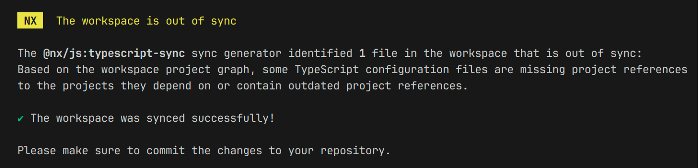
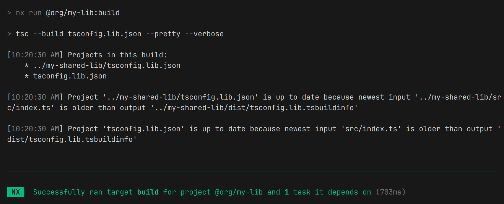

Nx 20 introduces a new [TS preset](https://nx.dev/nx-api/js/documents/typescript-project-references#create-a-new-nx-workspace-using-project-references), allowing developers to generate workspaces that leverage TypeScript project references. Given the promising claims, the confusion in the community, and the lack of literature on it, I decided to explore the feature.

## What are project references?

[Project references](https://www.typescriptlang.org/docs/handbook/project-references.html) were introduced in [TypeScript 3.0](https://devblogs.microsoft.com/typescript/announcing-typescript-3-0/#project-references) back in 2018. This feature allows you to _split the code into smaller units and define explicit relationships between them_. It ensures that only the changed units and their dependencies are recompiled, resulting in faster builds, improved code isolation, and a better IDE experience. This feature is well-suited for defining projects in a monorepo.

> **Note: 📌** <br> Project references are theoretically a better alternative to globally defined path aliases in the root `tsconfig.base.json` configuration.

## How to leverage project references in Nx?

### Generating a new workspace with project references

Nx 20 provides a new `ts` preset that leverages project references. Here's how to create a new workspace with this setup:

1. **Create a workspace with the `ts` preset:**

```bash
npx create-nx-workspace @org --preset=ts
```

This command creates a new workspace using the `ts` preset, which configures the project to use TypeScript project references. For all available options, see the [`create-nx-workspace` documentation](https://nx.dev/nx-api/nx/documents/create-nx-workspace).

2. **Generate libraries with the `tsc` bundler:**

```bash
nx g @nx/js:lib packages/my-lib --bundler=tsc
nx g @nx/js:lib packages/my-shared-lib --bundler=tsc
```

These commands the generator to create two libraries within the `packages` directory. The `--bundler=tsc` flag specifies using the TypeScript compiler (`tsc`) for building these libraries.

3. **Declare project dependencies:**

```json
// packages/my-lib/package.json
{
  "dependencies": {
    "@org/my-shared-lib": "*"
  }
}
```

Here, you explicitly declare dependencies in your `package.json` files. This tells Nx which projects your library relies on. Nx uses this information to manage project references.

4. **Update TypeScript references:**

While project references offer benefits, manually maintaining them in `tsconfig` files can be cumbersome. Nx provides the `nx sync` command:

```bash
nx sync
```

This command automatically updates TypeScript references based on the project dependencies declared in `package.json` files. It ensures your project references are always in sync.



> **Note: 📌** <br> Nx uses the standard `"workspaces": ["packages/*"]` property in the root `package.json` to analyze dependencies and sync references.

5. **Configure path alias:**

By default, project references work with relative imports. To import symbols from `@org/my-shared-lib` into `@org/my-lib`, you need to define the path alias in the base configuration:

```json
// tsconfig.base.json
{
  "compilerOptions": {
    "paths": {
      "@org/my-shared-lib": ["../my-shared-lib/src/index.ts"]
    }
  }
}
```
> **Note: 📌** <br> In contrast to global path aliases in integrated repositories, you can only import libraries explicitly declared as dependencies in a project's `package.json`, ensuring strict project boundaries.

6. **Build the library:**

With everything configured, you can build your library using the standard Nx command:

```bash
nx build @org/my-lib
```

The `build` target leverages TypeScript project references to only recompile the necessary parts of your codebase, resulting in faster builds ([up to 3 times](https://www.loom.com/share/7c3ad6a27a6b48d0b652cec248f51bbd)).



### Migrating existing workspaces

**Migrating to TypeScript project references is, unfortunately, a challenging process.**

The traditional path aliases approach used in integrated workspaces is incompatible with project references. Since these configurations cannot coexist, **migration requires a complete refactoring**, leaving no option for incremental updates.

Additionally, most Nx plugins (Angular, React, Vue, Node) are not yet compatible with project references. Migration is thus feasible only for small, package-based, framework-agnostic monorepos—a minority of real-world scenarios.

**If you're still determined to proceed, a manual approach is necessary:**

1. **Create a new workspace:** Start with a new workspace configured using the `ts` preset ([see the previous section](#generating-a-new-workspace-with-project-references)).
2. **Generate libraries:** Generate a few libraries to establish the desired structure.
3. **Compare and apply configurations:** Compare the new workspace's setup with your existing one, applying necessary changes in one single refactoring.

> **Warning: ⚠️** <br>  This process involves a big bang approach that is uncertain, risky, and time-consuming.

## Clarifying confusing points

### Nx incremental builds vs. TypeScript incremental builds

While both Nx and TypeScript offer incremental build capabilities, it's important to distinguish between them:

- **TypeScript incremental builds**: Focuses on the fine-grained level of individual files and modules. It leverages project references to identify dependencies and recompile only the affected parts of your codebase.
- **Nx incremental builds**: Takes a broader perspective, considering the entire monorepo. Nx analyzes the project graph to determine which parts of the codebase are impacted by a change, optimizing the build process at the project level.

Both Nx and TypeScript incrementally recompile only the necessary parts of your code. However, _Nx operates at a higher level_, offering more features like remote caching ([Nx Replay](https://nx.dev/ci/features/remote-cache)), distributed tasks execution ([Nx Agents](https://nx.dev/ci/features/distribute-task-execution#distribute-task-execution-nx-agents)), and first-class integration with your CI provider.

### Package-based repos, integrated repos, and the `ts` preset

> **Note: 📌** <br> As of Nx 20, the distinction between integrated and package-based repositories is less relevant. Nx features can be enabled independently, offering flexibility in configuring your monorepo.

- **Package-based repos:** Traditional approach for monorepos where each package is an independent project with its own `package.json` and nested `node_modules`.
- **Integrated repositories:** Nx's original approach, where dependencies are shared between projects at the root level in `tsconfig.base.json` using path aliases.
- **`ts` preset:** This new approach leverages TypeScript's project references along with individual `package.json` to declare dependencies between projects.

The `ts` preset aims to become the standard approach for new Nx projects, eventually replacing the integrated setup. **While it offers significant advantages, it's still in its early stages**.

## Overview of the `ts` preset and TypeScript project references

### Key benefits

- 🚀 **Faster builds and type-checking** <br>
  Only changed projects and their dependencies are recompiled, not the entire repository. This is particularly beneficial for large monorepos.
- 💻 **Improved IDE experience** <br>
  TypeScript's Language Server Protocol (LSP) benefits from faster type-checking and autocomplete, along with more accurate Go-To-Definition via [`declarationMap`](https://www.typescriptlang.org/tsconfig/#declarationMap).
- 🔒 **Enforced project boundaries** <br>
  Imports from arbitrary projects are disallowed unless explicitly referenced, ensuring stricter code organization.

### Current limitations

- 🛑 **No migration path for existing workspaces** <br>
  Existing Nx workspaces using path aliases cannot be easily migrated to project references. This requires starting with a new workspace.
- 📝 **Manual dependency configuration** <br>
  Dependencies between projects must be explicitly declared in `package.json` files for Nx to sync references correctly.
- ⚙️ **Complex setup with overhead** <br>
  This setup is not the default in Nx and is considerably more complex than configuring path aliases.
- ❌ **Lack of framework support** <br>
  Most plugins, including Angular, React, Vue, and Node, aren't supported at the moment.

## A promising future for large TypeScript monorepos

Nx 20's introduction of the `ts` preset and TypeScript project references marking a promising step toward scalable and efficient TypeScript code management. By leveraging these features, you can achieve faster build times, improve DX, and enhance code organization.

While the `ts` preset offers numerous benefits, **it's essential to consider the current limitations**. The lack of migration paths for existing workspaces, limited framework support, and the configuration overhead limit the adoption for most projects.

However, the potential for future improvements make it a promising approach for large-scale monorepos. As the Nx team works on supporting TypeScript better ([see Nx 2025 roadmap](https://github.com/nrwl/nx/discussions/28731)), we can expect progress in this area.

### References

- **[TypeScript Docs - Project References](https://www.typescriptlang.org/docs/handbook/project-references.html)** by TypeScript
- **[Nx Docs - Configure TypeScript Project References in an Nx Workspace](https://nx.dev/blog/announcing-nx-20#typescript-project-references-for-monorepos)** by Nx
- **[Announcing Nx 20 - TypeScript Project References For Monorepos](https://nx.dev/blog/announcing-nx-20#typescript-project-references-for-monorepos)** by Nx
- **[Benchmarking TS Project Reference Changes 📊](https://www.loom.com/share/7c3ad6a27a6b48d0b652cec248f51bbd)** by Jack Hsu
- **[Migrating Large TypeScript Codebases To Project References](https://shopify.engineering/migrating-large-typescript-codebases-project-references)** by Shopify
- **[Boost your productivity with TypeScript project references](https://blog.logrocket.com/boost-your-productivity-with-typescript-project-references/)** by LogRocket
- **[ixahmedxi/typescript-monorepo-demo](https://github.com/ixahmedxi/typescript-monorepo-demo)** by Ahmed Elsakaan

`oembed: https://www.youtube.com/watch?v=RRsttfhg1sA`
