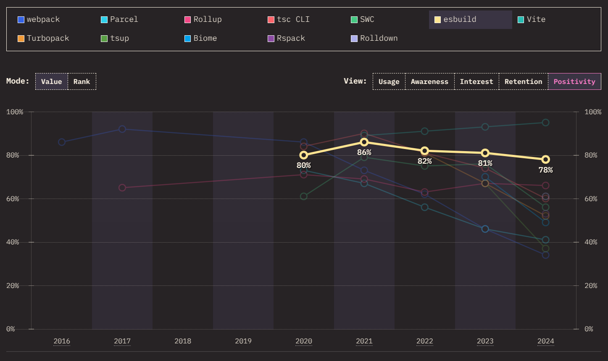
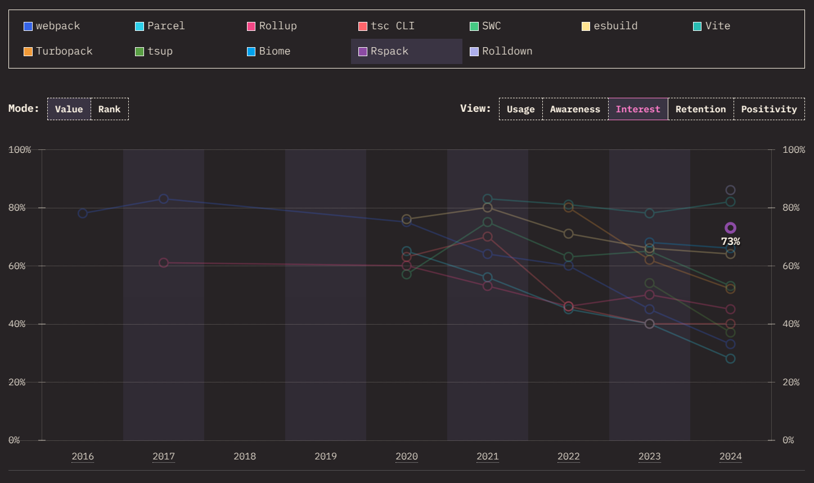

Recently real progress has been made around Rspack and Angular. This post will cover the current state of Rspack in Angular and what the future holds.

Let's start with a brief history of compiling and bundling in Angular.

## Angular CLI, my good old friend

Angular CLI **handles the build process and provides an easy interface for compiling and bundling Angular applications**. While powerful, the CLI has its limitations, particularly for _extending the build process_ or _integrating new tools_.

Integrating new build tools has always been a significant challenge:

- the CLI is doing a lot of work under the hood
- it is not trivial to understand
- it is not documented
- underlying functions are not exposed
- every single release can break your integration

Some time ago [I was naive enough to ignore these limitations and tried to integrate Rspack for Angular](https://github.com/edbzn/ng-rspack). I had to reverse-engineer the CLI, read the source code, and understand how it works internally—it was a great and painful learning experience.

`oembed: https://twitter.com/mgechev/status/1869510279782170847`

Hopefully in 2025 we can expect some progress in this area.

### Esbuild

Esbuild is the default bundler used internally by the CLI since Angular v17. It is **drastically faster than Webpack** but it is **not as feature-rich**.

#### Code-splitting

One limitation with Esbuild is its **lack of support for customizing the chunking strategy**, see the related issues:

- [**Max size/request control over chunk splitting** #1128](https://github.com/evanw/esbuild/issues/1128)
- [**Code splitting is creating many small unnecessary chunks** #3780](https://github.com/evanw/esbuild/issues/3780)
- [**Degraded Web Vitals after switching a universal app to esbuild** #27321](https://github.com/angular/angular-cli/issues/27321)
- [**Creating unnecessary excessive chunks** #27715](https://github.com/angular/angular-cli/issues/27715)

This can lead to excessive chunks loading and degraded Web Vitals, which is a major issue for performance-sensitive applications.

#### Module Federation

When building a micro-frontend architecture, we might want to use [Module Federation 2.0](https://module-federation.io/guide/start/index.html), which is not supported by Esbuild and Angular, so we're stuck with Webpack and everything it implies.

<Note>
Shout out to [Native Federation](https://www.npmjs.com/package/@angular-architects/native-federation) which provides a bundler agnostic solution compatible with Esbuild. It is inspired by Module Federation's mental model, but keep in mind that it is a different tool maintained by another team.
</Note>

#### TypeScript Project References

Another limitation is the lack of support for TypeScript Project References, which is a feature that allows splitting a large TypeScript project into smaller projects. This is useful for large applications, but it is not supported by Esbuild.

See my article on this topic: [Nx 20: Exploring the new TS preset and TypeScript project references](/nx-20-exploring-the-new-ts-preset-and-typescript-project-references/).

#### Positivity sentiment

In the [State of JavaScript 2024 survey](https://2024.stateofjs.com/en-US/libraries/build_tools/#build_tools_ratios), Esbuild positivity (proportion of positive sentiment among respondents who expressed a sentiment) is **slowly decreasing**.



## Rspack to the rescue

This is where [Rspack](https://rspack.dev/) and [Angular Rspack](https://angular-rspack.dev/) come into play.

> Rspack is a high performance JavaScript bundler written in Rust. It offers strong compatibility with the Webpack ecosystem, allowing for seamless replacement of Webpack, and provides lightning fast build speeds.

Rspack offers control over the chunking strategy and supports Module Federation out-of-the-box while being faster than Webpack. Sounds promising, right?

#### benchmarks

| Bundler       | Prod SSR     | Prod     | Dev     |
|---------------|--------------|----------|---------|
| 🐌 Webpack    | 348.707      | 224.226  | 234.449 |
| 🥉 Esbuild    | 28.509       | 24.521   | 18.719  |
| 🥈 Rsbuild    | 24.690       | 20.490   | 19.675  |
| 🏆 Rspack     | 19.974       | 18.239   | 16.477  |

Note that these results should be taken carefully and might not represent every use case, see the [benchmarks](https://github.com/Coly010/ng-bundler-benchmark) for more details.

#### Interest sentiment

In the [State of JavaScript 2024 survey](https://2024.stateofjs.com/en-US/libraries/build_tools/#build_tools_ratios), Rspack interest (proportion of positive sentiment among respondents having heard about an item) is **starting high in the charts**.




Now let's enter in the concrete part.

### Usage in Angular

<Note type="warning">
Rspack is not officially supported by Angular, while it is possible to use it, [Angular Rspack](https://angular-rspack.dev/) is not feature complete, might contain bugs, and is **not recommended for production applications**. Keep in mind that it is still a POC.
</Note>

```bash
npm install @rspack/cli @ng-rspack/build -D
```

Configuring Rspack should remind you the options of the Angular CLI:

```js
// rspack.config.js

const { createConfig } = require('@ng-rspack/build');

module.exports = createConfig({
  root: __dirname,
  name: 'demo',
  index: './src/index.html',
  assets: ['./public'],
  styles: ['./src/styles.css'],
  polyfills: ['zone.js'],
  main: './src/main.ts',
  outputPath: './dist/browser',
  tsConfig: './tsconfig.app.json',
});
```

Build and serve the application:

```bash
npx rspack build # or npx rspack dev
```

### Rsbuild usage

<Note>Rsbuild is a superset of Rspack, providing pre-configured setups with best practices.</Note>

Start by installing the dependencies:

```bash
npm i @rsbuild/core @ng-rspack/plugin-angular -D
```

#### CSR setup

Configuring Rsbuild with a CSR Angular application is straightforward:

```ts
// rsbuild.config.ts

import { createConfig } from '@ng-rspack/plugin-angular';

export default createConfig({
  browser: './src/main.ts',
});
```

#### SSR setup

SSR is supported as well, here's the setup for Rsbuild:

```ts
// rsbuild.config.ts

import { createConfig } from '@ng-rspack/plugin-angular';

export default createConfig({
  browser: './src/main.ts',
  server: './src/main.server.ts',
  ssrEntry: './src/server.ts',
});
```

Build and serve the application:

```bash
npx rsbuild build # or npx rsbuild dev
```

### Rsbuild with Nx (recommended)

The best way to use Rsbuild is with Nx. It provides an inference plugin for Rsbuild that detects the configuration file and infers the `build`, `dev`, and others targets.

```json
// nx.json

{
  "plugins": [
    {
      "plugin": "@nx/rsbuild",
      "options": {
        "buildTargetName": "build",
        "devTargetName": "dev",
        "previewTargetName": "preview",
        "inspectTargetName": "inspect",
        "typecheckTargetName": "typecheck"
      }
    }
  ]
}
```

You can configure Rsbuild like described in the previous section, and now you just need to run the Nx commands:

```bash
nx build demo # or nx dev demo
```

### Code-splitting

> Rspack supports code splitting, which allows splitting the code into other chunks. You have the full control about size and number of generated assets, which allow you to gain performance improvements in loading time.

Here's the default strategy:

```js
// rspack.config.js

module.exports = {
  //...
  optimization: {
    splitChunks: {
      chunks: 'async',
      minChunks: 1,
      minSize: 20000,
      maxAsyncRequests: 30,
      maxInitialRequests: 30,
      cacheGroups: {
        defaultVendors: {
          test: /[\\/]node_modules[\\/]/,
          priority: -10,
          reuseExistingChunk: true,
        },
        default: {
          minChunks: 2,
          priority: -20,
          reuseExistingChunk: true,
        },
      },
    },
  },
};
```

Note that this configuration is matching what we had previously with Webpack, which resolve the code-splitting issues mentioned above with Esbuild. Learn more about the [`SplitChunksPlugin`](https://rspack.dev/plugins/webpack/split-chunks-plugin) and how to customize it.

### Module Federation

> The Rspack team works closely with the Module Federation development team and provides first-class support for Module Federation.

Check-out the [official documentation for Module Federation with Rspack](https://rspack.dev/guide/features/module-federation).

<Note type="tip">In the following article [Nx and Angular with Rspack and Module Federation](https://www.angulararchitects.io/blog/nx-with-rspack-and-module-federation/), Manfred Steyer explains how to use Module Federation with Rspack and Nx. It is a great resource to get started with this setup.</Note>

### TypeScript project references

Rspack supports TypeScript project references out-of-the-box, so you can use the new TS preset with Angular and benefit from the performance improvements without waiting for Angular to officially support it.

## The future is bright

`oembed: https://twitter.com/victorsavkin/status/1880770676128362584`

Rspack is a promising tool; I'm deeply convinced that it will be a game-changer in the Angular ecosystem. Let's see how it's going to progress in 2025.

**Shout out to [Colum Ferry](https://x.com/FerryColum) for his amazing work on integrating Rspack for Angular**.

## References

- [Rspack](https://rspack.dev/) and [Rsbuild](https://rsbuild.dev/) by ByteDance
- [Angular Rspack](https://github.com/Coly010/ng-rspack-build) by Colum Ferry
- [Nx and Angular with Rspack and Module Federation](https://www.angulararchitects.io/blog/nx-with-rspack-and-module-federation/) by Manfred Steyer
