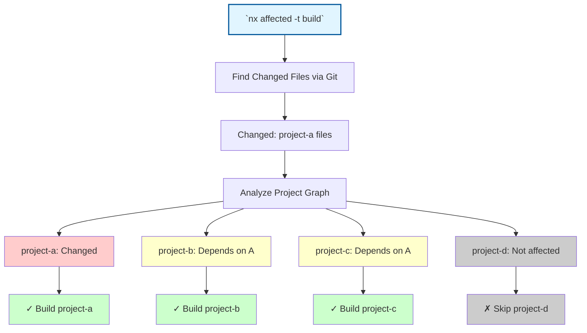
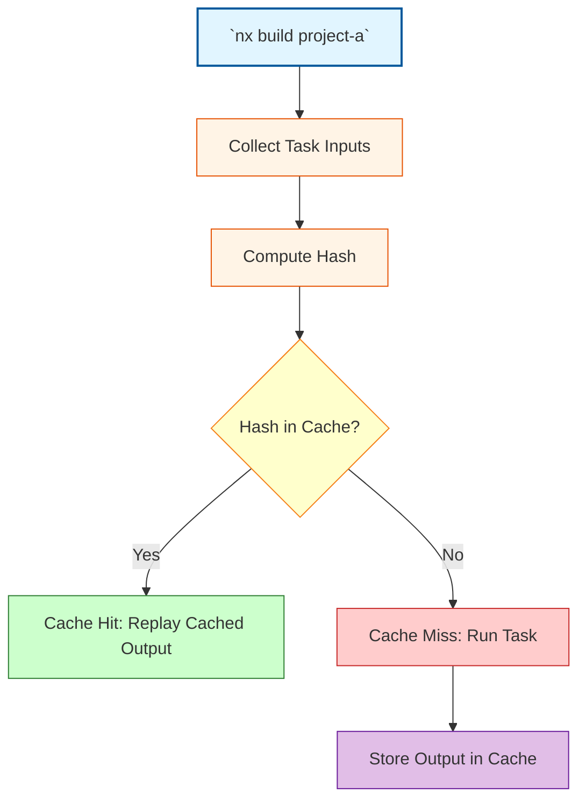

**Nx** provides powerful mechanisms to avoid redundant work in a monorepo. Two core concepts often mentioned are the **affected graph** and **cache hits**. While both improve efficiency, they address different stages of the build/test process.

This post will clarify what each concept means, how they work, and how they differ.

<Note>
Thanks to [Antoine Pairet](https://x.com/antoinepairet) for suggesting this blog post topic!
</Note>

## Nx Affected Graph: running only what's changed

One of Nx's most impactful features is the affected graph, which allows you to run tasks only on projects impacted by recent changes.

<Note type="tip">In simple terms, the affected graph helps us **to skip unnecessary work** and **focus only on the things that have been changed**.</Note>

### How is the affected graph computed?

When you run an affected command (e.g. `nx affected -t build`), Nx will:

1. **Finds changed files** using Git.
2. **Maps files to projects** using Nx's project graph.
3. **Includes dependent projects** that rely on the changed projects.

You can visualize this with:

```bash
nx graph --affected
```

### Diagram of the Affected Graph concept

**Scenario**: You modified files in `project-a` and run `nx affected -t build`. The diagram below shows how Nx identifies which projects need to be built based on the changes and their dependencies.



<Note> Projects `B` and `C` are affected because they depend on `A`, which was changed.</Note>

## Nx Computation Caching and Cache Hits: Reusing Previous Results

Nx also ensures that when a task is required, you don't redo work unnecessarily. This is thanks to **computation caching**.

### How does caching work?

Before executing any cacheable task, Nx computes a **hash** based on the task’s inputs, including:


- Source files of the project and its dependencies
- Configuration
- Runtime environment
- Command flags


This hash uniquely identifies the state of the project for that task. Nx then checks if it has seen this exact computation before:


- If a **matching hash exists in the cache** (a cache hit), Nx will skip executing the task and instead retrieve the previously saved results. It pulls from the cache the task’s outputs (e.g. build artifacts) and even replays the terminal logs.
- If **no cached result is found** (a cache miss), Nx will run the task as normal. Once the task completes, Nx stores the output files and terminal output in the cache for future use.


<Note>

By default, Nx caches task results locally on your machine. For even greater benefit in team environments and CI pipelines, Nx can use **remote caching** (Nx Cloud) so that if one developer or CI job has already built a project, others can get a cache hit and skip rebuilding it.

</Note>

### Diagram of caching concept

**Scenario**: You run `nx build project-a`. The diagram below illustrates how Nx checks if this exact build has been done before by computing a hash and looking it up in the cache.



<Note type="tip">
Cache ensures repeated work isn't done if inputs haven't changed.
</Note>

## Key differences between Affected Graph and Cache Hits


| Feature       | Affected Graph                        | Cache Hit                                       |
| ------------- | ------------------------------------- | ----------------------------------------------- |
| **Purpose**   | Determines what needs to run          | Skips task execution if identical work was done |
| **When Used** | Before deciding what tasks to run     | Right before executing a task                   |
| **Based On**  | Git diffs and project dependencies    | Hash of task inputs and configuration           |
| **Benefit**   | Limits work to only impacted projects | Reuses previous task results to save time       |

## Conclusion

The **affected graph** answers “_What needs to run?_" while **cache hits** answer “_Has this work already been done?_". Combining both ensures that you:

- Skip unaffected projects entirely.
- Skip execution for tasks with unchanged inputs.

This is why Nx is effective in managing performance and scalability in monorepos.


## Resources

- [Nx.dev - Guide: How Caching Works](https://nx.dev/docs/concepts/how-caching-works)
- [Nx.dev - Mental model: Affected commands](https://nx.dev/docs/concepts/mental-model#affected-commands)
